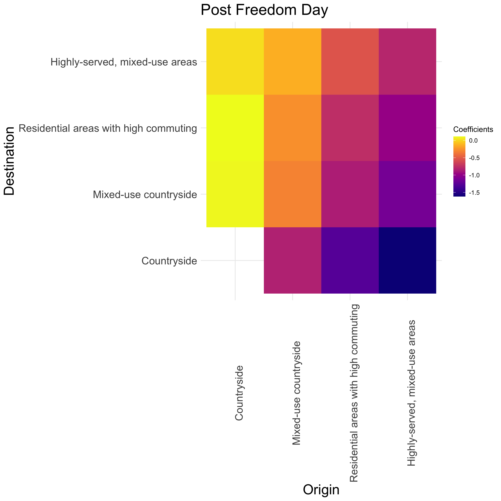

# Human Mobility During COVID-19

[Francisco Rowe](http://www.franciscorowe.com) [[`@fcorowe`](http://twitter.com/fcorowe)]<sup>1</sup>, Alessia Calafiore [[`@alel_domi
`](https://twitter.com/alel_domi)]<sup>1</sup>, Dani Arribas-Bel [[`@darribas
`](https://twitter.com/darribas)]<sup>1,2</sup>, Krasen Samardzhiev<sup>1</sup>, Martin Fleischmann[[`@martinfleis`
](https://twitter.com/martinfleis)]<sup>1</sup>

<sup>1</sup> *Geographic Data Science Lab, University of Liverpool, Liverpool, United Kingdom*. 
<sup>2</sup> *The Alan Turing Institute, British Library, 96 Euston Road, London, England, NW1 2DB, United Kingdom*. 

This repository stores the required code to replicate the results of the following article:

```
Rowe, F., Calafiore, A., Arribas-Bel, D., Samardzhiev, K., Fleischmann, M. 2022. Urban Exodus? Understanding Human Mobility in Britain During the COVID-19 Pandemic Using Facebook Data.
```

This paper aims to analyse the extent and durability of changes in human mobility patterns across the rural-urban continuum in Britain during the COVID-19 pandemic, covering an 18-month period from March 2020 to August 2021. Specifically this paper seeks to address the following set of questions:
* To what extent have people moved away from cities, and redistributed across the urban-rural continuum during the pandemic?  
* What have been the key interactions between places across the population density hierarchy? Have people mainly moved to sparely populated areas?  
* To what extent the intensity of population movement from cities have been sustained throughout the pandemic? Have the observed changes been temporary, or are likely to persist post pandemic?
* 


